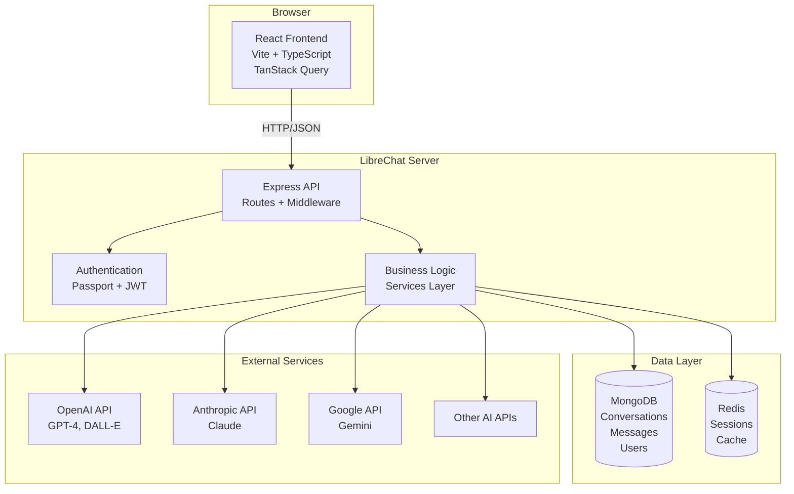
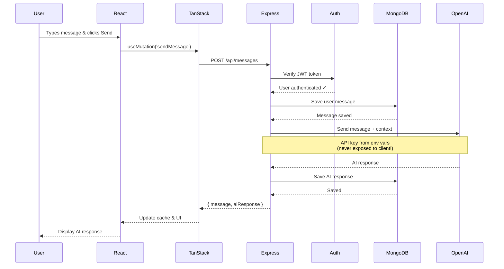
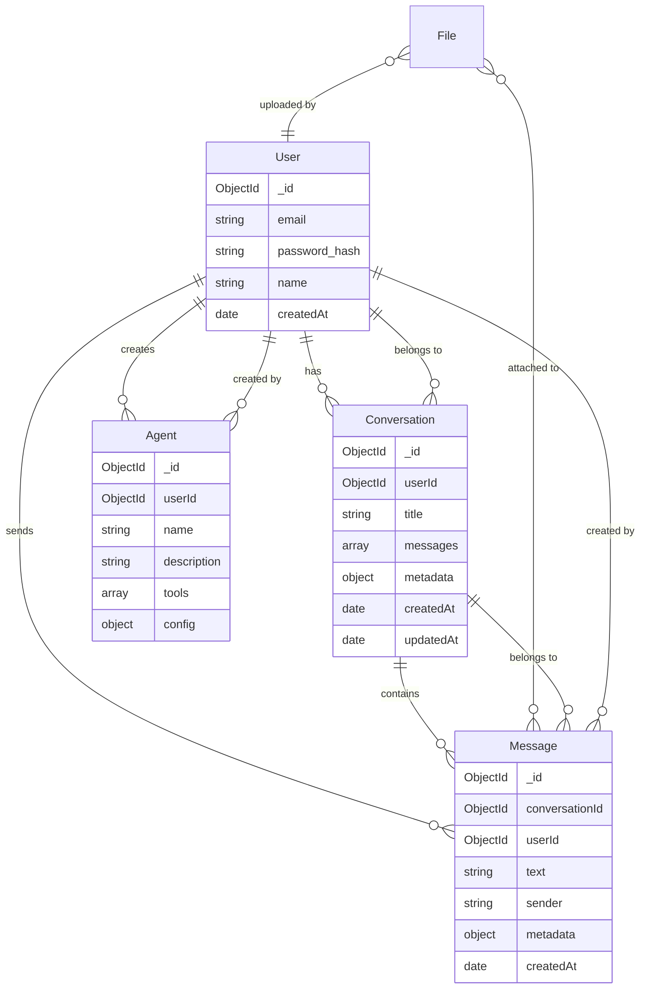
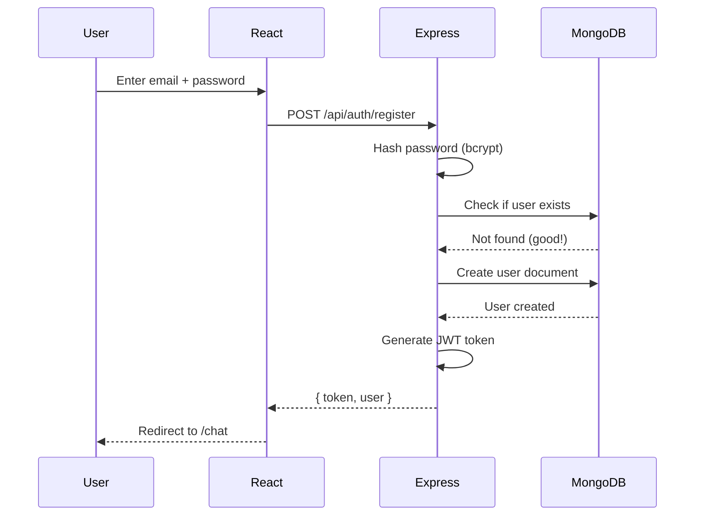
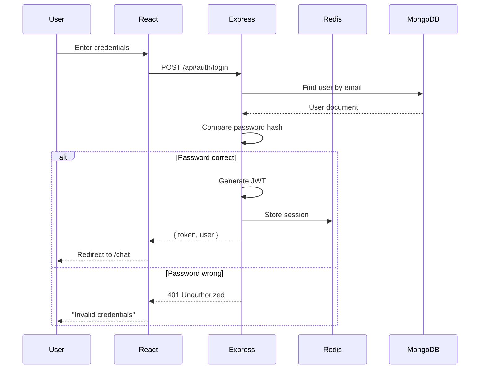
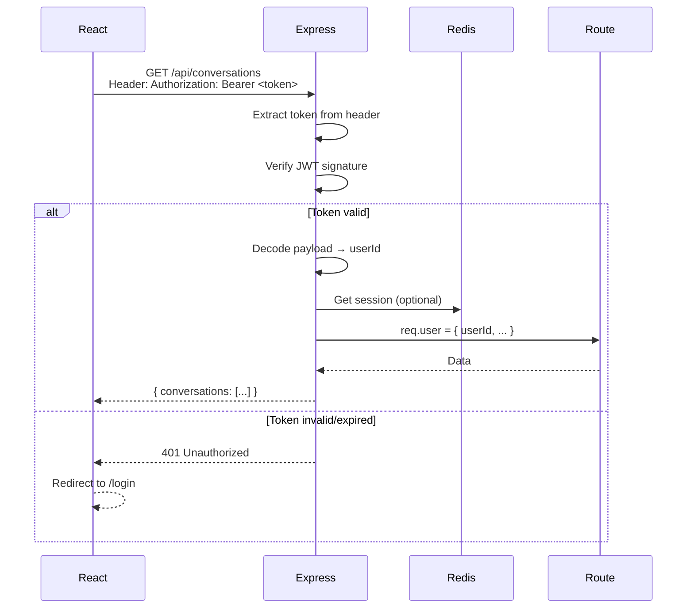
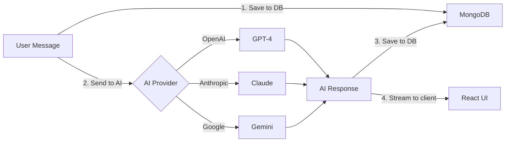
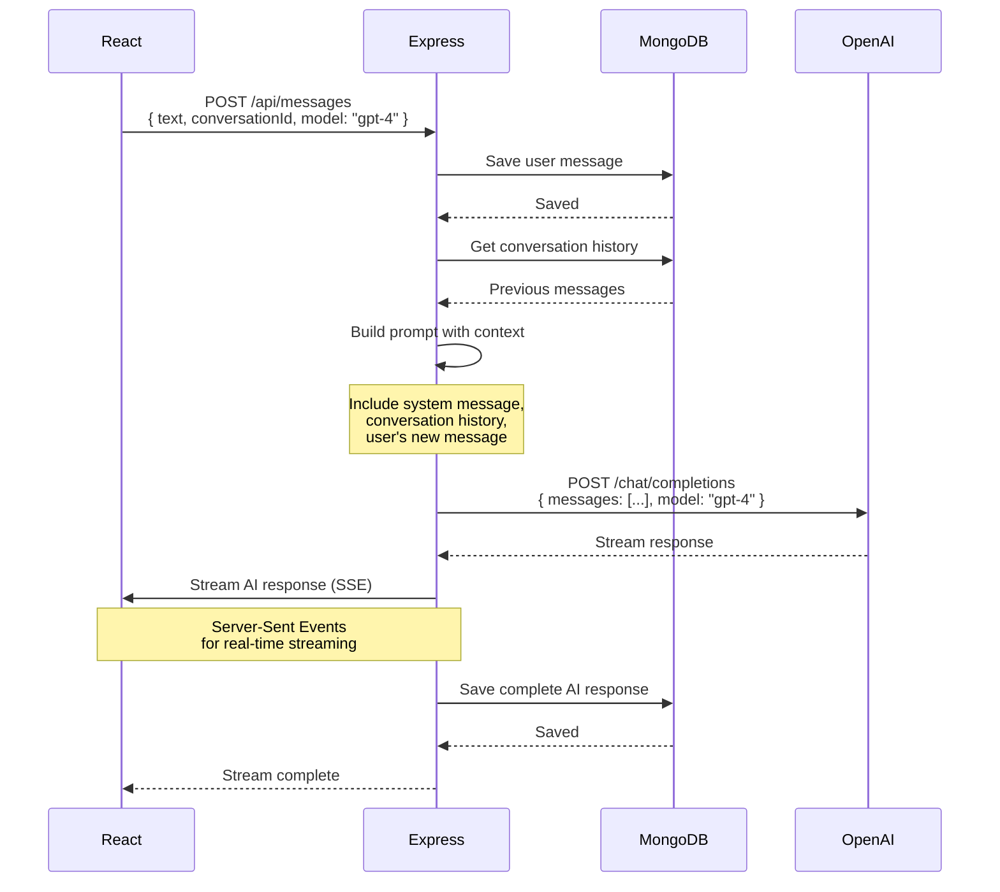
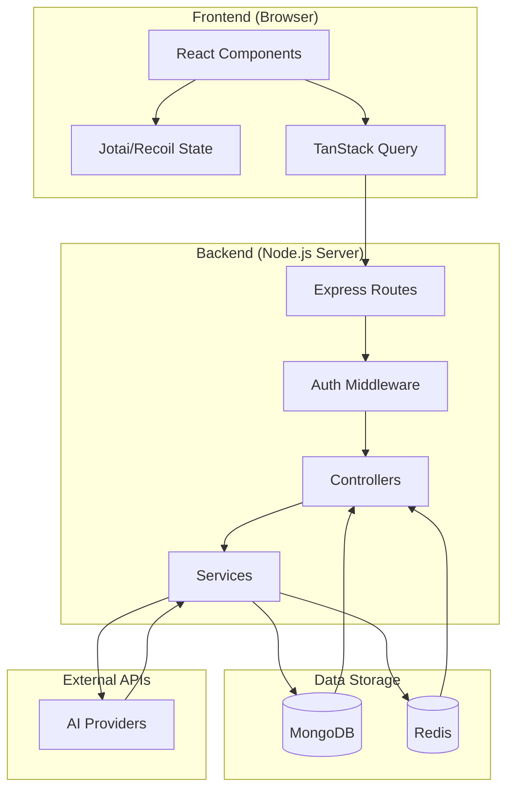

# 🏗️ LibreChat Architecture Overview

**Documented:** November 19, 2025
**Target:** Mid-level React developers learning full-stack
**Time Estimate:** 1-2 hours
**Difficulty:** 🟢 Beginner

---

## Table of Contents

- [The Big Picture](#the-big-picture)
- [High-Level Architecture](#high-level-architecture)
- [Request/Response Flow](#requestresponse-flow)
- [System Components](#system-components)
- [Data Architecture](#data-architecture)
- [Authentication Flow](#authentication-flow)
- [AI Provider Integration](#ai-provider-integration)
- [Why This Architecture?](#why-this-architecture)
- [Mental Models for React Devs](#mental-models-for-react-devs)
- [Next Steps](#next-steps)

---

## The Big Picture

### What is LibreChat?

**LibreChat** is a full-stack web application that provides a unified chat interface for multiple AI providers (OpenAI, Anthropic, Google, etc.). Think of it as **"Spotify for AI chatbots"** - one app, many services.

### 30-Second Overview

```
User clicks "Send" → React component → API request → Express server →
MongoDB (save message) → OpenAI/Claude/etc (get AI response) →
Save AI response to MongoDB → Send back to React → Update UI
```

### 🧠 Mental Model

**For React Developers:**

Imagine your typical React app, but instead of:
- `localStorage` for data → **MongoDB database** (persists forever)
- Fetching from external APIs → **Your own backend API** (you control it!)
- `useEffect` for data fetching → **TanStack Query** (handles caching, refetching)
- Client-side routing → **Client-side routing** (same!)

**The key difference:** LibreChat has a **backend server** that:
1. Handles authentication (login, sessions)
2. Stores data in a database (conversations, messages, users)
3. Makes API calls to AI providers (OpenAI, Anthropic, etc.)
4. Protects API keys (never exposed to browser!)

---

## High-Level Architecture



### Component Breakdown

| Component | Technology | Purpose |
|-----------|-----------|---------|
| **Frontend** | React 18 + TypeScript | User interface, chat UI, forms |
| **Build Tool** | Vite 6.4 | Fast dev server, optimized builds |
| **API Server** | Express 4.21 | HTTP server, routing, middleware |
| **Database** | MongoDB 6+ | Persistent data storage |
| **Cache** | Redis 7+ | Session storage, fast lookups |
| **Auth** | Passport.js + JWT | User authentication |
| **AI SDKs** | OpenAI, Anthropic, etc. | AI provider integrations |

---

## Request/Response Flow

### Scenario: User Sends a Chat Message



### 🎯 Key Points

1. **JWT in headers** - Every request includes `Authorization: Bearer <token>`
2. **Middleware validates** - Before handling request, check if user is logged in
3. **Database persistence** - Every message is saved (unlike localStorage)
4. **AI API calls** - Made server-side (API keys stay secret)
5. **React Query caching** - Frontend caches responses, avoids duplicate requests

---

## System Components

### 1. Frontend (Client)

**Location:** `client/src/`

**Purpose:** User interface for chat, settings, authentication

**Key Technologies:**
- **React 18** - Component-based UI
- **TypeScript** - Type safety
- **Vite** - Dev server & build tool
- **TanStack Query** - Data fetching & caching
- **Tailwind CSS** - Utility-first styling
- **Jotai/Recoil** - Atomic state management
- **React Router** - Client-side routing

**Architecture Pattern:**
```
src/
├── components/        # React components (UI)
├── hooks/            # Custom React hooks
├── store/            # Global state (Jotai/Recoil atoms)
├── data-provider/    # TanStack Query hooks (API calls)
├── routes/           # React Router pages
└── utils/            # Helper functions
```

**🌉 Bridge from React:**
This is familiar territory! It's a standard React SPA. The only difference is:
- **TanStack Query** instead of useEffect for data fetching
- **Atomic state** (Jotai/Recoil) instead of Context API
- **Tailwind** for styling instead of CSS-in-JS

---

### 2. Backend API (Server)

**Location:** `api/server/`

**Purpose:** HTTP server, business logic, data persistence

**Key Technologies:**
- **Express 4.21** - Web framework
- **Mongoose 8.12** - MongoDB ODM
- **Passport.js** - Authentication
- **JWT** - Token-based auth
- **Winston** - Logging

**Architecture Pattern: MVC-ish**
```
server/
├── routes/           # API endpoints (URLs)
│   ├── messages.js   # POST /api/messages
│   ├── auth.js       # POST /api/auth/login
│   └── ...
├── controllers/      # Request handlers (handle HTTP req/res)
│   ├── MessageController.js
│   └── ...
├── services/         # Business logic (pure logic, no req/res)
│   ├── MessageService.js
│   └── ...
├── middleware/       # Express middleware (auth, validation, errors)
│   ├── requireJwtAuth.js
│   ├── validateRequest.js
│   └── ...
└── index.js         # Server entry point
```

**🌉 Bridge from React:**

| React Pattern | Backend Equivalent |
|---------------|-------------------|
| Component renders UI | Controller handles HTTP request |
| Custom hook for logic | Service function for logic |
| Props passed down | Middleware passes data via `req` |
| State updates | Database updates |
| Event handlers | Route handlers |

**Example Flow:**
```javascript
// React: Button click → Event handler
<button onClick={handleSubmit}>Send</button>

// Backend: HTTP request → Route → Controller
app.post('/api/messages', requireAuth, MessageController.create)
```

---

### 3. Database (MongoDB)

**Purpose:** Persistent data storage

**Why MongoDB?**
- **JSON-like documents** - Feels like JavaScript objects
- **Flexible schema** - Add fields without migrations (initially)
- **Great for chat data** - Nested messages, arbitrary metadata
- **Popular with Node.js** - Excellent tooling (Mongoose)

**Main Collections (think "tables"):**
- `users` - User accounts
- `conversations` - Chat conversations
- `messages` - Individual messages
- `files` - Uploaded files
- `agents` - Custom AI agents
- `prompts` - Saved prompts

**🌉 Bridge from React:**

| React/Frontend | MongoDB |
|----------------|---------|
| JavaScript object | Document (BSON, like JSON) |
| Array of objects | Collection (like array of docs) |
| Component state | Database (but persists!) |
| localStorage | Database (but structured & queryable) |

**Example Document:**
```javascript
// Message document in MongoDB
{
  _id: ObjectId("507f1f77bcf86cd799439011"),
  conversationId: ObjectId("..."),
  text: "Hello, how are you?",
  sender: "user",
  userId: ObjectId("..."),
  createdAt: ISODate("2025-11-19T10:30:00Z"),
  metadata: { ... }
}
```

---

### 4. Cache (Redis)

**Purpose:** Fast in-memory data storage

**Used For:**
- **Sessions** - Keep users logged in
- **Rate limiting** - Prevent API abuse
- **Temporary data** - API response caching
- **Pub/Sub** - Real-time features (if used)

**Why Redis?**
- **Blazing fast** - Sub-millisecond reads
- **In-memory** - Data stored in RAM
- **Key-value store** - Simple: `SET key value`, `GET key`

**🌉 Bridge from React:**

| React/Frontend | Redis |
|----------------|-------|
| `const [state, setState]` | `SET key value` |
| `localStorage.setItem()` | `SET key value` (but server-side) |
| `sessionStorage` | Redis session store (but works across requests!) |

**Example Usage:**
```javascript
// Store session
redis.set('session:abc123', JSON.stringify({ userId: '...' }))

// Get session
const session = await redis.get('session:abc123')
```

---

### 5. Authentication (Passport + JWT)

**Purpose:** Secure user login and API access

**How It Works:**

1. **User logs in** → Username/password sent to `/api/auth/login`
2. **Server validates** → Check password hash in MongoDB
3. **Generate JWT token** → Signed with `JWT_SECRET` from .env
4. **Return token** → Frontend stores in memory (or cookie)
5. **Future requests** → Include token in `Authorization` header
6. **Middleware validates** → `requireJwtAuth` checks token before accessing routes

**JWT Structure:**
```
Header.Payload.Signature
```

**Example JWT Payload:**
```json
{
  "userId": "507f1f77bcf86cd799439011",
  "email": "user@example.com",
  "iat": 1700000000,
  "exp": 1700086400
}
```

**🌉 Bridge from React:**

| React Pattern | Backend Auth |
|---------------|--------------|
| `if (user) render()` | `if (req.user) next()` |
| Redirect to /login | Return 401 Unauthorized |
| Check auth in useEffect | Check auth in middleware |
| Store user in context | User data in `req.user` |

---

## Data Architecture

### Entity Relationship Diagram



### Key Relationships

1. **User → Conversations** (One-to-Many)
   - One user has many conversations
   - Each conversation belongs to one user

2. **Conversation → Messages** (One-to-Many)
   - One conversation has many messages
   - Each message belongs to one conversation

3. **User → Messages** (One-to-Many)
   - One user creates many messages
   - Each message is created by one user

4. **Files ↔ Messages** (Many-to-Many)
   - Files can be attached to multiple messages
   - Messages can have multiple files

---

## Authentication Flow

### Registration Flow



### Login Flow



### Protected Route Access



---

## AI Provider Integration

### How AI Chat Works



### Message Flow with AI



### Why Backend Makes AI Calls

**❌ Bad: Call OpenAI from React directly**
```javascript
// NEVER DO THIS - Exposes API key!
const response = await fetch('https://api.openai.com/v1/chat/completions', {
  headers: {
    'Authorization': `Bearer ${OPENAI_API_KEY}` // ← EXPOSED IN BROWSER!
  }
})
```

**✅ Good: Call your backend, backend calls OpenAI**
```javascript
// React: Call your API
const response = await fetch('/api/messages', {
  method: 'POST',
  headers: {
    'Authorization': `Bearer ${userToken}` // ← Your app's token
  },
  body: JSON.stringify({ text: 'Hello!' })
})

// Express backend: Call OpenAI (API key safe in .env)
const aiResponse = await openai.chat.completions.create({
  model: 'gpt-4',
  messages: [...],
  // API key from process.env, never sent to client!
})
```

**🎯 Remember This:**
**API keys = Money** - If exposed in frontend, anyone can steal and use them!
Backend protects keys and controls usage/costs.

---

## Why This Architecture?

### Design Decisions Explained

#### Why MongoDB (NoSQL)?

**✅ Pros:**
- Chat data is **document-oriented** (messages are JSON-like)
- **Flexible schema** - Easy to add new fields
- **Fast for reads** - Optimized for fetching conversations
- **Great for JSON** - Native JavaScript support

**⚠️ Cons:**
- Less strict than SQL (no enforced foreign keys)
- Eventual consistency (in distributed setups)
- Harder to do complex joins (though Mongoose helps)

**Alternative:** PostgreSQL (SQL) would work but require more schema migrations

---

#### Why Redis for Sessions?

**✅ Pros:**
- **In-memory = fast** - Sub-millisecond lookups
- **Automatic expiration** - Sessions auto-delete after timeout
- **Horizontal scaling** - Multiple Express servers can share sessions

**⚠️ Cons:**
- Data lost if Redis crashes (unless persistence enabled)
- Costs RAM (but sessions are small)

**Alternative:** Session cookies (simpler) or database sessions (slower)

---

#### Why Express (not Next.js, NestJS, etc.)?

**✅ Pros:**
- **Minimal & flexible** - Not opinionated, full control
- **Huge ecosystem** - Thousands of middleware packages
- **Mature & stable** - Battle-tested for 10+ years
- **Easy to learn** - Simple API, good for beginners

**⚠️ Cons:**
- Less structure than NestJS (need to organize yourself)
- Not TypeScript-first (but works fine with TS)

**Alternatives:**
- **Next.js** - Great for full-stack but more opinionated
- **NestJS** - More structured, TypeScript-first, steeper learning curve
- **Fastify** - Faster but smaller ecosystem

---

#### Why Monorepo (Workspaces)?

**✅ Pros:**
- **Shared types** - TypeScript types shared between frontend/backend
- **Atomic commits** - Change both in one PR
- **Single repo** - Easier to navigate
- **Shared packages** - `data-provider`, `data-schemas` reused

**⚠️ Cons:**
- Bigger repo
- Dependency management across packages

**Alternative:** Separate repos for frontend/backend (more isolation)

---

## Mental Models for React Devs

### 1. Components → Routes → Controllers

**React:**
```javascript
// Component handles UI event
function MessageForm() {
  const handleSubmit = (text) => {
    // Send to API
    sendMessage(text)
  }
  return <form onSubmit={handleSubmit}>...</form>
}
```

**Backend:**
```javascript
// Route handles HTTP request
app.post('/api/messages', (req, res) => {
  const { text } = req.body
  // Process message
  const message = await MessageService.create(text)
  res.json(message)
})
```

---

### 2. Custom Hooks → Service Functions

**React:**
```javascript
// Custom hook for logic
function useMessages() {
  const [messages, setMessages] = useState([])
  const fetchMessages = async () => {
    const data = await api.getMessages()
    setMessages(data)
  }
  return { messages, fetchMessages }
}
```

**Backend:**
```javascript
// Service function for logic
class MessageService {
  static async getMessages(userId) {
    const messages = await Message.find({ userId })
    return messages
  }
}
```

---

### 3. Context/Props → Middleware

**React:**
```javascript
// Pass data down via Context
<UserContext.Provider value={user}>
  <App />
</UserContext.Provider>

// Access in child components
const user = useContext(UserContext)
```

**Backend:**
```javascript
// Pass data via req object
function requireAuth(req, res, next) {
  req.user = { id: '123', email: 'user@example.com' }
  next() // Pass to next middleware/route
}

// Access in route
app.get('/api/profile', requireAuth, (req, res) => {
  res.json(req.user) // User data from middleware!
})
```

---

### 4. useState/useReducer → Database

**React:**
```javascript
// Temporary state in component
const [messages, setMessages] = useState([])

// Add message
setMessages([...messages, newMessage])

// State lost on refresh!
```

**Backend:**
```javascript
// Persistent state in database
const messages = await Message.find()

// Add message
await Message.create(newMessage)

// Data persists forever (or until deleted)
```

---

### 5. useEffect → Middleware Chain

**React:**
```javascript
// useEffect runs in sequence
useEffect(() => {
  // 1. Check auth
  if (!user) return

  // 2. Fetch data
  fetchData()

  // 3. Update UI
  setLoading(false)
}, [])
```

**Backend:**
```javascript
// Middleware runs in sequence
app.get('/api/data',
  requireAuth,        // 1. Check auth
  fetchDataMiddleware, // 2. Fetch data
  (req, res) => {
    // 3. Send response
    res.json(req.data)
  }
)
```

---

## System Architecture Summary



---

## Next Steps

Now that you understand the architecture, here's what to explore next:

### 1. Deep Dive into Project Structure
**Next:** [PROJECT_STRUCTURE.md](./PROJECT_STRUCTURE.md)
- Detailed file/folder organization
- Where to find specific functionality
- Import patterns and aliases

### 2. Understand the Tech Stack
**Next:** [TECH_STACK_GUIDE.md](./TECH_STACK_GUIDE.md)
- Deeper dive into each technology
- Why each was chosen
- How they work together

### 3. Follow Data Through the System
**Next:** [DATA_FLOW_GUIDE.md](./DATA_FLOW_GUIDE.md)
- Step-by-step request tracing
- Complete workflows (login, send message, etc.)
- Debugging techniques

### 4. Explore Frontend or Backend
**Frontend:** [FRONTEND_ARCHITECTURE.md](./FRONTEND_ARCHITECTURE.md)
**Backend:** [BACKEND_ARCHITECTURE.md](./BACKEND_ARCHITECTURE.md)

---

## 🎯 Key Takeaways

After reading this guide, you should understand:

✅ **LibreChat is a 3-tier architecture:**
   - Frontend (React)
   - Backend (Express API)
   - Data (MongoDB + Redis)

✅ **Request flow:**
   - User action → React → HTTP request → Express → Database/AI → Response → React → UI update

✅ **Why backend exists:**
   - Protect API keys
   - Persistent data storage
   - User authentication
   - Business logic

✅ **How it compares to React-only apps:**
   - More moving parts
   - But same JavaScript!
   - Concepts map 1:1 (components → routes, hooks → services, etc.)

---

## 📚 Further Reading

- [Getting Started](./GETTING_STARTED.md) - Set up locally
- [Project Structure](./PROJECT_STRUCTURE.md) - File organization
- [Tech Stack Guide](./TECH_STACK_GUIDE.md) - Technology deep dive
- [Integration Guide](./INTEGRATION_GUIDE.md) - Frontend ↔ Backend communication

---

**Back to:** [Learning Path Home](./README.md)

---

*Last updated: November 19, 2025*
*LibreChat version: v0.8.1-rc1*
